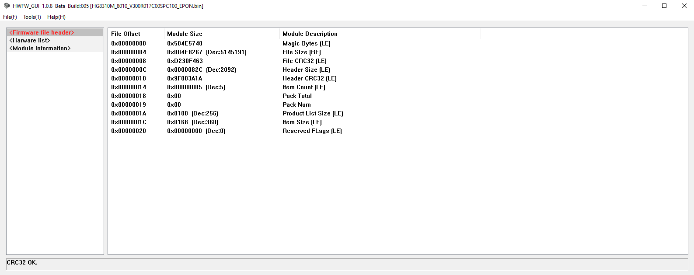
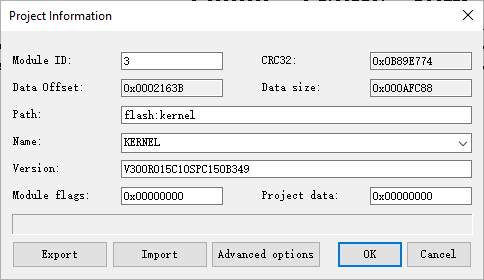
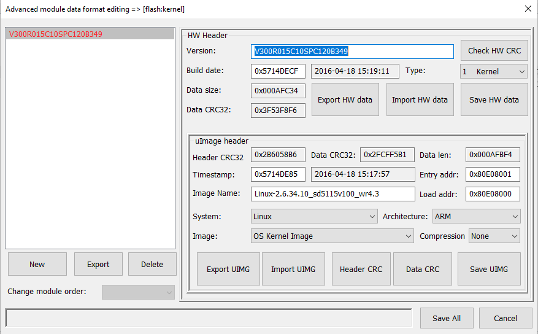

# HWFW_GUI
HuaWei ONT Firmware Editor - GUI

Screenshots
-------

ChangeLog
-------
### 1.0.8 Beta Build 005
- Fixed file and sub-module export size calculation
- Fixed a crash when deleting sub-modules

### 1.0.8 Alpha Build 002
- Added the option to edit supported product list
- Added support for parsing of R018 and R019 firmware
- Added support for sub-module alignment for V5 firmware
- Other minor bugs

### 1.0.4 Alpha Build 001
- Added tab for browsing supported product models

### 1.0.3 Alpha Build 003
- Added advanced header data editing capabilities
- 细节修复
- Code indentation optimization

Donate
------- 
If the software is helpful to you, please consider donating the original author to support its continued development!

#### 微信 (WeChat)

#### 支付宝 (Alipay)

License
-------

Copyright (C) 2019 csersoft

This program is free software: you can redistribute it and/or modify
it under the terms of the GNU General Public License as published by
the Free Software Foundation, either version 3 of the License, or
(at your option) any later version.

This program is distributed in the hope that it will be useful,
but WITHOUT ANY WARRANTY; without even the implied warranty of
MERCHANTABILITY or FITNESS FOR A PARTICULAR PURPOSE.  See the
GNU General Public License for more details.

You should have received a copy of the GNU General Public License
along with this program.  If not, see <http://www.gnu.org/licenses/>.
